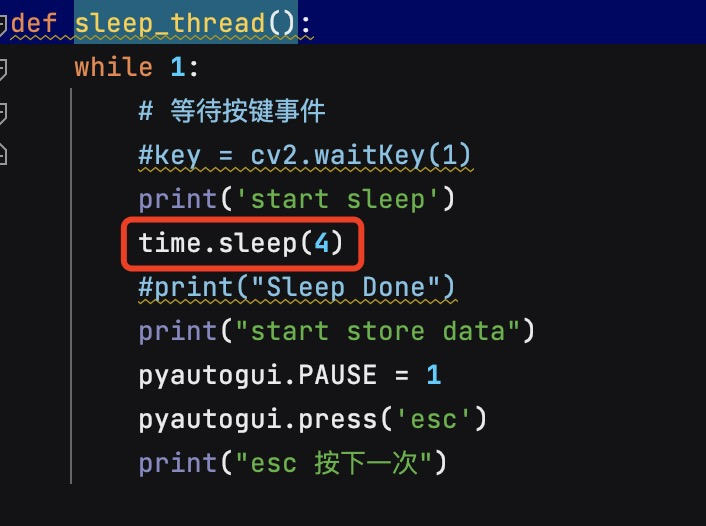
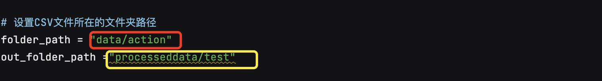
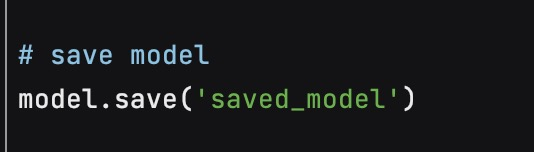

# 2023
# nuitrick and realsense 435i recognition for action
## Motion Recognition Project
## Instructions for use in English
========================== instructions for use ===================================
### Pre-requisites
##### 1. For nuitrack library installation, please refer to https://github.com/3DiVi/nuitrack-sdk/tree/master/PythonNuitrack-beta.
###### If it is non-python programming language please refer to https://github.com/3DiVi/nuitrack-sdk/
##### 2. Please refer to requirements.txt for the remaining dependency packages

### If you don't need to increase the number of actions or source data, but only need to call the model to achieve recognition then please focus on the following easy to use steps:
##### Refer to the apitest.py file, which is an example of using the model under python, with the necessary procedures annotated.
###### ---> The actual recognition process is the same as processing the input model data, which requires capturing new actions with realsense.
###### --->The currently trained model is in the saved_model folder, just follow the example to process the capture data and input it into the model for prediction.
###### --->The currently trained model supports recognizing four actions: wave wave, applause applaud, towards_left to the left, towards_right to the right.

### If you need to increase the number of actions or source data, please pay attention to the following:
##### 1. You need to have the nuitrack library installed
##### and has realsense camera and has realsense sdk (https://dev.intelrealsense.com/docs?_ga=2.28082111.2055464687.1695306645- 2061829742.1688457389)
##### 2. Collect new data using videodataGet.py:
###### First, manually create the required category folders under the data folder, such as wave, applaud, towards_left, towards_right that currently exist.
###### Run it directly and follow the prompts in simplified Chinese to collect data, one operation is one action. Please make sure that the action is the same when you keep collecting actions.
###### At present, the default time to collect an action is 4s, if you want to change the time to collect an action, find the function sleep_thread() in ulits.py file.

###### Modify the value in the red circle part to modify the number of seconds to capture one action.
###### After stopping the operation, you can see the action just collected in the default folder data/action, manually transfer it to the corresponding category folder, for example, the action just collected is wave, then put it into data/wave.
##### 3, process the source data obtained in step2, use preprocessing.py file
##### 
###### The red circled part is the source data folder (e.g. data/wave in step 2) and the yellow circled part is the folder where the processed generated is ready to be used for training (processeddata/wave)
###### Run preprocessing.py to get the processed data under processeddata, and then copy the files under the preprocesseddata folder to dataset after all the processed data are finally processed (you can also change the path in train.py to preprocesseddata, and then copy the files to dataset). (You can also change the path in train.py to preprocesseddata, just in case there is a problem copying the data for an archive) .
##### 4. Train the model and run train.py.
###### default save model to saved_model, if you want to change the save path
##### 
###### Directly modify it to the desired folder.
##### 5. Use the newly trained model, again refer to apitest.py.
# 动作识别项目
## 中文简体版使用说明
==========================使用说明===================================
### 前置条件
##### 1、nuitrack库的安装，请参考https://github.com/3DiVi/nuitrack-sdk/tree/master/PythonNuitrack-beta。
###### 如果是非python编程语言请参考https://github.com/3DiVi/nuitrack-sdk/
##### 2、剩下的依赖包请参考requirements.txt

### 如果不需要增加动作或者源数据的数量，而是只需要调用模型实现识别那么请关注下面的简易使用步骤：
##### 参考apitest.py文件，这是一个python下使用模型的例子，必要的过程都进行了备注。
###### --->实际识别的过程中与输入模型数据的处理是一样的，需要用realsense捕捉新的动作。
###### --->目前已经训练好的模型在saved_model文件夹下，按照示例处理捕捉数据并输入模型进行预测即可。
###### --->目前已经训练好的模型支持识别四个动作：wave挥手，applaud鼓掌，towards_left向左，towards_right向右。

### 如果需要增加动作或者源数据的数量，请关注下面的内容：
##### 1、需要安装nuitrack库
##### 且具有realsense摄像头且具备realsense的sdk（https://dev.intelrealsense.com/docs?_ga=2.28082111.2055464687.1695306645-2061829742.1688457389）
##### 2、采集新数据使用videodataGet.py：
###### 先在data文件夹下手动创建需要的分类文件夹，比如目前已经存在的wave、applaud、towards_left、towards_right。
###### 直接运行按照简体字提示进行操作即可采集数据，一次操作为一个动作。持续采集动作时请保证为同一动作。
###### 目前默认的一个动作采集4s，如果想要修改采集一个动作的时间，在ulits.py文件找到sleep_thread()的function

###### 修改红色圈部分的数值即可修改采集一个动作的秒数。
###### 停止运行后可以在目前的默认文件夹data/action看到刚刚采集的动作，手动转移到对应的分类文件夹，比如刚刚采集的动作为wave那么就放入data/wave下即可。
##### 3、处理在step2得到的源数据，使用preprocessing.py文件
##### 
###### 红色圈部分为源数据文件夹（比如步骤2中的data/wave），黄色圈部分为处理好的生成的准备用于训练的文件夹（processeddata/wave）
###### 运行preprocessing.py即可获得processddata下处理好的数据，最终全部处理好后，将preprocesseddata文件夹下的文件复制到dataset（也可以修改train.py中的path为preprocesseddata，这里只是以防万一出现问题复制数据做一个存档） 。
##### 4、训练模型，运行train.py
###### 默认保存模型到saved_model,如果想要修改保存路径
##### 
###### 直接修改为需要的文件夹即可。
##### 5、使用新训练的模型，同样参照apitest.py即可。
   
   

